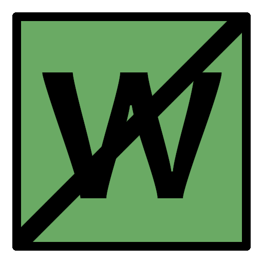
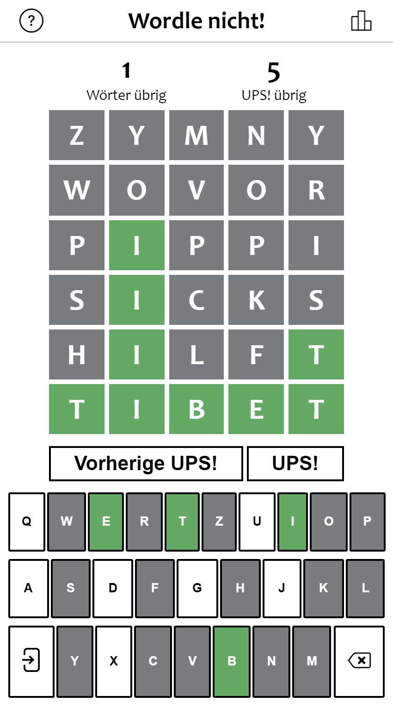

<!-- Improved compatibility of back to top link: See: https://github.com/othneildrew/Best-README-Template/pull/73 -->
<a name="readme-top"></a>
<!--
*** Thanks for checking out the Best-README-Template. If you have a suggestion
*** that would make this better, please fork the repo and create a pull request
*** or simply open an issue with the tag "enhancement".
*** Don't forget to give the project a star!
*** Thanks again! Now go create something AMAZING! :D
-->


<!-- PROJECT SHIELDS -->
<!--
*** I'm using markdown "reference style" links for readability.
*** Reference links are enclosed in brackets [ ] instead of parentheses ( ).
*** See the bottom of this document for the declaration of the reference variables
*** for contributors-url, forks-url, etc. This is an optional, concise syntax you may use.
*** https://www.markdownguide.org/basic-syntax/#reference-style-links
-->
[![Contributors][contributors-shield]][contributors-url]
[![Forks][forks-shield]][forks-url]
[![Stargazers][stars-shield]][stars-url]
[![Issues][issues-shield]][issues-url]
[![MIT License][license-shield]][license-url]


<!-- PROJECT LOGO -->
<br />
<div align="center">
<a href="https://drovara.github.io/wordle-nicht/">
    
</a>
<h3 align="center">wordle-nicht</h3>

  <p align="center">
    <a href="https://drovara.github.io/wordle-nicht/">Try it out!</a>
  </p>
</div>


<!-- TABLE OF CONTENTS -->
<details>
  <summary>Table of Contents</summary>
  <ol>
    <li>
      <a href="#about-the-project">About The Project</a>
      <ul>
        <li><a href="#built-with">Built With</a></li>
      </ul>
    </li>
    <li>
      <a href="#getting-started">Getting Started</a>
      <ul>
        <li><a href="#prerequisites">Prerequisites</a></li>
        <li><a href="#installation">Installation</a></li>
        <li><a href="#running-the-project">Running the Project</a></li>
      </ul>
    </li>
    <li><a href="#usage">Usage</a></li>
    <li><a href="#roadmap">Roadmap</a></li>
    <li><a href="#contributing">Contributing</a></li>
    <li><a href="#license">License</a></li>
    <li><a href="#contact">Contact</a></li>
    <li><a href="#acknowledgments">Acknowledgments</a></li>
  </ol>
</details>


<!-- ABOUT THE PROJECT -->
## About The Project

<div align="center">
 
</div>

This is a German implementation of the word game "Don't Wordle", a variation of "Wordle", where it is your goal to <b>NOT</b> find the daily solution.

<p align="right">(<a href="#readme-top">back to top</a>)</p>


### Built With

* [![Next][Next.js]][Next-url]
* [![React][React.js]][React-url]
* [![Typescript][typescriptlang.com]][Typescript-url]

<p align="right">(<a href="#readme-top">back to top</a>)</p>


<!-- GETTING STARTED -->
## Getting Started

You can play "wordle nicht!" on its <a href="https://drovara.github.io/wordle-nicht/">Github Pages site</a>.

<a name="getting-started"></a>
To get a local copy up and running follow these simple steps.

### Prerequisites

This project runs on a node.js backend. If you haven't already, please install `npm` to run it.
  ```sh
  npm install npm@latest -g
  ```

### Installation

1. Clone the repo
   ```sh
   git clone https://github.com/DRovara/wordle-nicht.git
   ```
2. Install NPM packages
   ```sh
   npm install
   ```

After completing these steps, the node server will be ready to be run locally.

### Running the Project

You can run a development version of the project by running
```sh
    npm run dev
```

Alternatively, you can build and run _wordle nicht!_ using
```sh
    npm run build
    npm run start
```

After running the development or release version of _wordle nicht!_, you can access it through your browser on `localhost:3000`.

<p align="right">(<a href="#readme-top">back to top</a>)</p>


<!-- USAGE EXAMPLES -->
## Usage

In _wordle nicht!_ it is your goal to enter six guess words consisting of five letters each, without accidentally entering the secret solution word. However, there is a catch: After each guess, letters are marked to indicate their role in the result:
- **green** letters appear in the solution at exactly the same place.
- **amber** letters appear in the solution but at a different place.
- **grey** letters do not appear in the solution at all.

Once the game has informed you of the role of a letter, all further guesses you make must conform to these roles. For instance, if your guess contains the letter _e_ on the fourth position and it is marked _green_, all further guesses must include an _e_ on that position. On the other hand, if your guess contains the latter _a_ on the second position and it is marked _amber_, all further guesses must include the letter _a_ and you are no longer allowed to enter guesses with an _a_ at position two.

In order to prevent unfortunate guesses that are very similar to the solution from ruining the game, you are allowed to undo five of your guesses each game using the "UPS" button. This allows you to provide other guesses, acting as if you had never entered the undone word.

<!-- CONTRIBUTING -->
## Contributing

Any contributions you make are appreciated.

If you have a suggestion that would make this better, please fork the repo and create a pull request. You can also simply open an issue with the tag "enhancement".
Don't forget to give the project a star! Thanks again!

1. Fork the Project
2. Create your Feature Branch (`git checkout -b feature/AmazingFeature`)
3. Commit your Changes (`git commit -m 'Add some AmazingFeature'`)
4. Push to the Branch (`git push origin feature/AmazingFeature`)
5. Open a Pull Request

<p align="right">(<a href="#readme-top">back to top</a>)</p>


<!-- LICENSE -->
## License

Distributed under the MIT License. See `LICENSE.txt` for more information.

<p align="right">(<a href="#readme-top">back to top</a>)</p>


<!-- CONTACT -->
## Contact

Project Link: [https://github.com/DRovara/wordle-nicht](https://github.com/DRovara/wordle-nicht)

<p align="right">(<a href="#readme-top">back to top</a>)</p>


<!-- MARKDOWN LINKS & IMAGES -->
<!-- https://www.markdownguide.org/basic-syntax/#reference-style-links -->
[contributors-shield]: https://img.shields.io/github/contributors/DRovara/wordle-nicht.svg?style=for-the-badge
[contributors-url]: https://github.com/DRovara/wordle-nicht/graphs/contributors
[forks-shield]: https://img.shields.io/github/forks/DRovara/wordle-nicht.svg?style=for-the-badge
[forks-url]: https://github.com/DRovara/wordle-nicht/network/members
[stars-shield]: https://img.shields.io/github/stars/DRovara/wordle-nicht.svg?style=for-the-badge
[stars-url]: https://github.com/DRovara/wordle-nicht/stargazers
[issues-shield]: https://img.shields.io/github/issues/DRovara/wordle-nicht.svg?style=for-the-badge
[issues-url]: https://github.com/DRovara/wordle-nicht/issues
[license-shield]: https://img.shields.io/github/license/DRovara/wordle-nicht.svg?style=for-the-badge
[license-url]: https://github.com/DRovara/wordle-nicht/blob/master/LICENSE.txt

<!-- Screenshots -->
[screenshot]: images/screenshot.png


[Next.js]: https://img.shields.io/badge/next.js-000000?style=for-the-badge&logo=nextdotjs&logoColor=white
[Next-url]: https://nextjs.org/
[typescriptlang.com]: https://img.shields.io/badge/TypeScript-000000?style=for-the-badge&logo=typescript&logoColor=blue
[Typescript-url]: https://www.typescriptlang.org/
[React.js]: https://img.shields.io/badge/React-20232A?style=for-the-badge&logo=react&logoColor=61DAFB
[React-url]: https://reactjs.org/
[Vue.js]: https://img.shields.io/badge/Vue.js-35495E?style=for-the-badge&logo=vuedotjs&logoColor=4FC08D
[Vue-url]: https://vuejs.org/
[Angular.io]: https://img.shields.io/badge/Angular-DD0031?style=for-the-badge&logo=angular&logoColor=white
[Angular-url]: https://angular.io/
[Svelte.dev]: https://img.shields.io/badge/Svelte-4A4A55?style=for-the-badge&logo=svelte&logoColor=FF3E00
[Svelte-url]: https://svelte.dev/
[Laravel.com]: https://img.shields.io/badge/Laravel-FF2D20?style=for-the-badge&logo=laravel&logoColor=white
[Laravel-url]: https://laravel.com
[Bootstrap.com]: https://img.shields.io/badge/Bootstrap-563D7C?style=for-the-badge&logo=bootstrap&logoColor=white
[Bootstrap-url]: https://getbootstrap.com
[JQuery.com]: https://img.shields.io/badge/jQuery-0769AD?style=for-the-badge&logo=jquery&logoColor=white
[JQuery-url]: https://jquery.com 